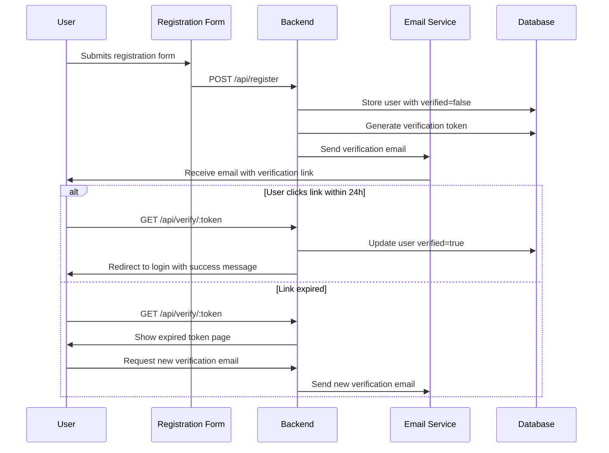

```mermaid
    sequenceDiagram
        participant U as User
        participant F as Registration Form
        participant B as Backend
        participant E as Email Service
        participant D as Database

        U->>F: Submits registration form
        F->>B: POST /api/register
        B->>D: Store user with verified=false
        B->>D: Generate verification token
        B->>E: Send verification email
        E->>U: Receive email with verification link

        alt User clicks link within 24h
            U->>B: GET /api/verify/:token
            B->>D: Update user verified=true
            B->>U: Redirect to login with success message
        else Link expired
            U->>B: GET /api/verify/:token
            B->>U: Show expired token page
            U->>B: Request new verification email
            B->>E: Send new verification email
        end
```
